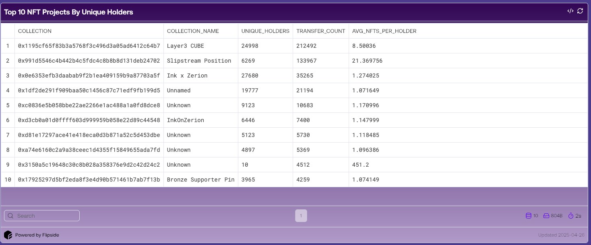

# Ink Blockchain Dashboard Using SQL on Flipside Crypto.
On-chain data analysis using Flipside Crypto platform. Use of SQL queries and dashboard for the Ink blockchain activities.

🔗 **Live Dashboard:** [HERE](https://flipsidecrypto.xyz/ivy-k/ink-chain-transaction-and-activity-analysis-5HtJbK)

## Description:

Developed an interactive dashboard using Flipside Crypto to analyse the Ink blockchain token transactions and user activity. 
Extracted on-chain data with SQL, filtered high-volume tokens and visualised trends in transaction volume, token usage and user behaviour to support data-driven insights into the blockchain activity.

## Key Insights:

-  **Unique Wallet Participation:**
     Monthly active wallet count showed consistent growth up to January 2025, reflecting increasing user engagement. However, activity has declined since then, likely due to broader market conditions.

-  **Smart Contract Usage:** A large portion of transactions are contract-related, suggesting INK is used for more than just transfers — possibly dApps or token interactions. This metric has shown steady growth over time.
-  **Developer Activity:** Weekly unique contract deployers spiked in January and March 2025, but overall developer activity remains relatively low, suggesting a small but occasionally active builder community.
-  **Token Transfer Pattern:** WETH and stablecoins dominate transfer volume on INK, signaling that the chain is primarily used for financial transactions like trading, bridging, or liquidity movement — rather than for speculative or entertainment use cases (e.g., meme tokens or NFTs).

## Potential Use Cases:
- **For protocol teams**: Monitor user and dev adoption on INK.
- **For investors**: Evaluate chain utility (finance-focused vs. speculative).
- **For analysts**: Benchmark growth against other Layer2s.
  
## 🛠 Tools Used:
- SQL
- **Flipside Dashboards** for visualisation

## 🗂️ Screenshot / Preview

